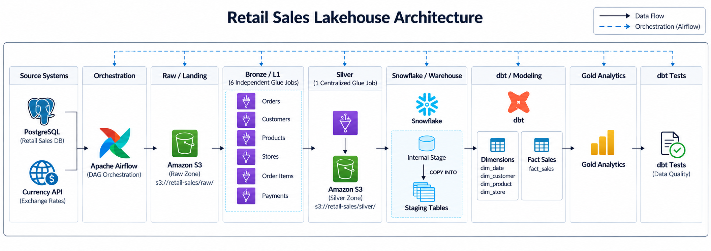

# Retail Sales Lakehouse Architecture

Architecture Diagram:

## Pipeline Flow

PostgreSQL + Currency API  
→ Apache Airflow  
→ Amazon S3 Raw/Landing  
→ 6 Bronze/L1 AWS Glue Jobs  
→ 1 Silver AWS Glue Job  
→ S3 Silver Parquet  
→ Snowflake Internal Stage  
→ Snowflake Staging Tables  
→ dbt  
→ Dimension + Fact Models  
→ Gold Analytics  
→ dbt Tests

## Architecture Overview

The pipeline starts with retail data from PostgreSQL and exchange-rate data from a Currency API.

Airflow orchestrates the pipeline and coordinates ingestion, validation, and processing. Raw data is landed in Amazon S3 and processed through separate Bronze/L1 AWS Glue jobs.

A centralized Silver AWS Glue job cleans and transforms the Bronze data before storing the curated datasets in S3.

The curated data is loaded into Snowflake, where dbt builds staging models, dimensions, fact tables, and Gold analytics models. dbt tests are used to validate the resulting data models.

## Main Design

The pipeline is organized into separate layers for ingestion, transformation, warehouse loading, and analytical modeling.

Airflow orchestrates the pipeline, Amazon S3 provides the data lake and intermediate storage, AWS Glue performs data transformation, Snowflake provides the analytical warehouse, and dbt handles data modeling and testing.

The layered design keeps ingestion, transformation, storage, and analytics independently manageable and easier to maintain.
